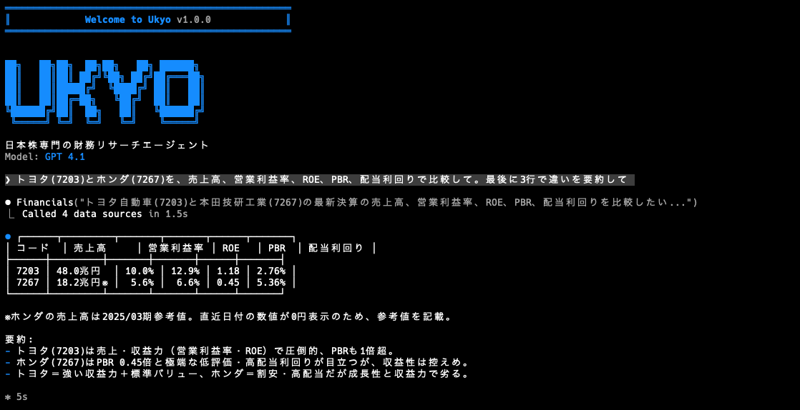

# Ukyo — 日本株専門財務リサーチエージェント

Ukyo は Dexter をベースに、日本株分析向けへ再設計した自律型リサーチエージェントです。J-Quants V2 API と LLM を組み合わせ、東証上場銘柄の株価、財務、決算予定、信用取引、投資部門別動向、IR 書類の調査を日本語で支援します。



## Table of Contents

- [Overview](#overview)
- [Prerequisites](#prerequisites)
- [Setup](#setup)
- [Run](#run)
- [Example Prompts](#example-prompts)
- [Evaluate](#evaluate)
- [Debug](#debug)
- [WhatsApp Gateway](#whatsapp-gateway)
- [Contributing](#contributing)
- [License](#license)

## Overview

Ukyo は複雑な日本株の質問を、実行可能なリサーチ手順へ分解しながら進めます。単に数値を返すだけでなく、株価、財務、投資指標、信用需給、投資家動向、IR 資料の探索をまたいで、根拠付きの日本語回答へまとめます。

**主な機能:**

- **日本株向けデータ取得**: J-Quants V2 API を使って、株価・財務サマリー・決算予定・信用取引・投資部門別情報を取得
- **日本語の表示最適化**: `1兆円` / `1000億円` のような金額表示と `YYYY/MM/DD` 日付表示
- **銘柄解決**: 社名、証券コード、代表的な別名から東証コードを解決
- **IR 調査補助**: EDINET / TDnet / 公式 IR を優先した書類検索・読解ガイド
- **エージェント実行**: タスク分解、自己検証、ツール選択を通じた段階的な調査

## Prerequisites

- [Bun](https://bun.sh) 1.0 以上
- J-Quants API アカウント
  - **Premium 推奨**: Ukyo の全機能を試すなら最も安全です
  - **Standard / Light**: 株価、上場銘柄一覧、財務サマリー、決算予定、信用取引など一部機能向け
  - **Free**: 直近 12 週間を除く遅延データ中心のため、動作確認用途に限定されます
- 利用する LLM の API キーを 1 つ以上
  - `OPENAI_API_KEY`
  - `ANTHROPIC_API_KEY`
  - `GOOGLE_API_KEY`
  - `XAI_API_KEY`
  - `OPENROUTER_API_KEY`
  - `MOONSHOT_API_KEY`
  - `DEEPSEEK_API_KEY`
- `EXASEARCH_API_KEY`（推奨）
  - `read_filings` や IR / 大量保有報告書まわりの調査品質が上がります

#### Installing Bun

If you don't have Bun installed:

**macOS / Linux**

```bash
curl -fsSL https://bun.sh/install | bash
```

**Windows**

```bash
powershell -c "irm bun.sh/install.ps1|iex"
```

After installation:

```bash
bun --version
```

## Setup

1. Clone this repository and move into the project directory.

```bash
git clone <your-repo-url>
cd dexter
```

2. Install dependencies.

```bash
bun install
```

3. Copy the environment file and set the keys you want to use.

```bash
cp env.example .env
```

最小構成の例:

```bash
OPENAI_API_KEY=your-openai-api-key
JQUANTS_API_KEY=your-jquants-api-key
EXASEARCH_API_KEY=your-exa-api-key
```

J-Quants の API キーは [J-Quants ダッシュボード](https://jpx-jquants.com/dashboard/menu/) の V2 API 設定から取得します。

## Run

対話モードで起動:

```bash
bun start
```

監視付きで開発する場合:

```bash
bun dev
```

## Example Prompts

```text
トヨタ(7203)の最新株価を教えて
キーエンス(6861)のPBRと配当利回りを計算して
ソニーグループの直近4期の財務推移を要約して
信用倍率が高い銘柄のリスクを説明して
外国人投資家の最近の売買動向を教えて
この会社のIR資料を読むときに注目すべき論点を整理して
あなたは誰ですか？
```

## Evaluate

eval runner はそのまま利用できます。

```bash
bun run src/evals/run.ts
```

ランダムサンプルで回す場合:

```bash
bun run src/evals/run.ts --sample 10
```

LangSmith を使う場合は `.env` に `LANGSMITH_API_KEY` を設定してください。

## Debug

Ukyo は各クエリのツール呼び出しを `.dexter/scratchpad/` に JSONL として保存します。調査過程や取得データを追いたいときはここを見るのが最短です。

**Scratchpad location**

```text
.dexter/scratchpad/
├── 2026-01-30-111400_9a8f10723f79.jsonl
├── 2026-01-30-143022_a1b2c3d4e5f6.jsonl
└── ...
```

各エントリには次のような情報が入ります。

- `init`: 元の質問
- `tool_result`: ツール呼び出し、引数、結果、要約
- `thinking`: エージェントの途中思考

## WhatsApp Gateway

WhatsApp Gateway を使うと、自分宛てチャット経由で Ukyo に質問できます。

```bash
# QR コードで WhatsApp をリンク
bun run gateway:login

# Gateway を起動
bun run gateway
```

詳細は [WhatsApp Gateway README](src/gateway/channels/whatsapp/README.md) を参照してください。

## Contributing

1. Fork the repository
2. Create a feature branch
3. Commit your changes
4. Push the branch
5. Open a Pull Request

Pull Request は小さく、レビューしやすい単位に分けるのがおすすめです。

## License

This project is licensed under the MIT License.
